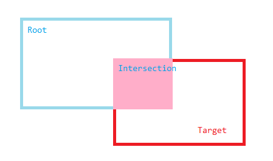

本篇文章将会探索一个非常好用的 Web API——
[`IntersectionObserver`](https://developer.mozilla.org/en-US/docs/Web/API/IntersectionObserver) API。
`IntersectionObserver`提供给我们一种高效的方式去处理元素在视口中的可见性相关的问题，
如前端常用的[图像懒加载](https://developers.google.com/web/fundamentals/performance/lazy-loading-guidance/images-and-video)，
可以使用这个 API 轻松地实现。

<!--more-->

## 核心概念

首先，IntersectionObserver API 是处理元素的可见性问题。从直觉上来说，
比如有一个很长的网页，我们刚刚打开网页时，我们看不见页面底部的内容。
也就是说，处于页面底部的元素对于我们是不可见的。然而，
对于程序而言，我们需要一个更加精确的定义，什么情况下是可见，
什么情况下是不可见。这里就引出了与 IntersectionObserver API 的三个核心概念，
[Root](https://w3c.github.io/IntersectionObserver/#dom-intersectionobserver-root)（根）、
[Target](https://w3c.github.io/IntersectionObserver/#intersectionobserver-target)（目标）以及
[Intersection Ratio](https://w3c.github.io/IntersectionObserver/#dom-intersectionobserverentry-intersectionratio)（重叠比率）。
所谓*root*，可以想象成我们的视野，是我们能够“看见”的区域。_target_，
就是我们监视的元素。如果*target*进入了我们的视野，
也就是*root*与*target*发生了重叠。
此时，重叠部分的面积与目标的面积的比率就是*intersection ratio*。



root 可以是视口本身，也可以是一个元素。
我们经常会使用视口作为 root 去实现像图像懒加载这样的功能。
当某个元素作为 root 时，一般而言这个元素应该是可以滚动的。
（如果 root 元素不能滚动，使用 IntersectionObserver 是没有意义的，
因为重叠率是一个常数，我们没有必要去监视一个不可变的东西，
至于下面就会知道答案）。

## API 的使用方式

IntersectionObserver API 的使用很简单，如下所示:

```javascript
const root = document.getElementById("my-element");
const callbackFunc = () => {};
// 通过构造函数指定IntersectionObserver的回调函数以及root
const observer = new IntersectionObserver(callbackFunc, {
  root,
  rootMargin: "0px 0px 100px 0px",
  threshold: 0
});

// 然后使用.observe方法把root与target串联起来
const target = document.getElementById("my-target");
observer.observe(target);
```

`rootMargin`类似 CSS 中`margin`属性，可以缩小或者放大 root 的“可视区域”。
与`margin`不同的是，`rootMargin`只支持`px`与百分比作为单位。

`threshold`规定了一系列阈值，当重叠率“穿越”一个阈值时，
会触发 observer 中的回调函数。所谓“穿越”是指，如有一个阈值为 0.5，
当用户滚动 root 元素，使重叠率从 0.49 变到 0.51 时，回调函数会触发；
反之，从 0.51 变到 0.49 时也会触发。`threshold`接受一个 0 到 1 之间的浮点数，
或者一个浮点数数组，当`threshold`为数组时，该数组内所有的数都是阈值。

##
